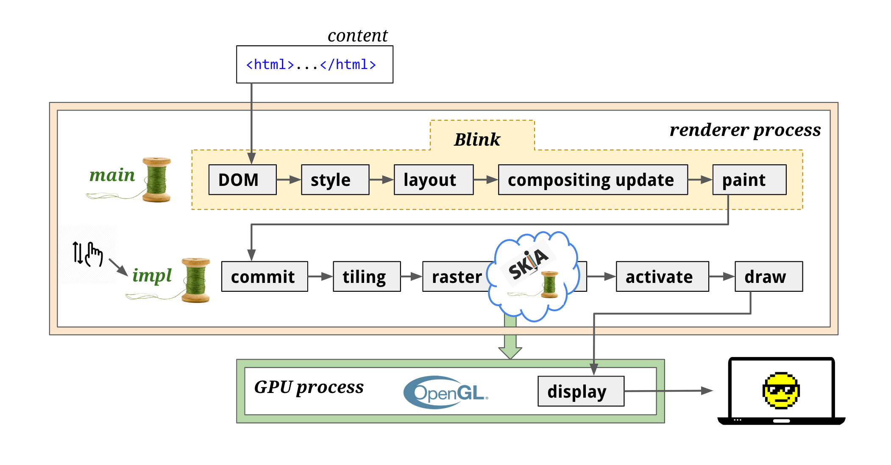

title: WebGL概述
speaker: haoli
js:
  - library/webgl-utils.js
  - library/webgl-debug.js
  - library/cuon-utils.js
  - library/three.min.js
  - library/GLTFLoader.js
  - library/RGBELoader.js
  - library/EquirectangularToCubeGenerator.js
  - library/PMREMGenerator.js
  - library/PMREMCubeUVPacker.js
  - js/helmet.js
  - js/triangle.js
  - js/texture1.js
  - js/texture2.js
  - js/shader.js
  - js/translate.js
  
css:
  - style/main.css
plugins:
  - katex
prismTheme: solarizedlight

<slide>

<div id="container"></div>

# WebGL概述{.text-landing.text-shadow}

By haoli {.text-intro}

[:fa-github:Github](https://github.com/chaos1ee/webgl-ppt){.button.ghost}

<slide class="slide-top" :class="size-60">

## 目录{.text-landing.aligncenter}

---

- #### WebGL基础
- #### 使用着色器渲染纹理
<!-- - #### 矩阵运算与图形变换 -->

<slide>

## WebGL基础{.aligncenter}

### WebGL定义

WebGL是一项用来在网页上绘制和渲染复杂三维图形，并允许用户与之进行交互的技术。WebGL程序由JavaScript编写的句柄和OpenGL Shading Language（GLSL）编写的着色器代码组成，该语言类似于C或C++，并在电脑的图形处理（GPU）上运行。WebGL由非营利Khronos Group设计和维护。

WebGL程序包括运行在浏览器中的JavaScript和运行在WebGL系统中的着色器程序这两部分，其中：

- 顶点着色器将指定点的位置和尺寸。
- 片元着色器将指定点的颜色。

### 硬件加速




### WebGL基本图形

WebGL可以绘制7种基本图形

| 基本图形 | 参数              | 描述                                                                                                                                                                          |
| :------: | ----------------- | ----------------------------------------------------------------------------------------------------------------------------------------------------------------------------- |
|    点    | gl.POINTS         | 一系列的点，绘制在 v0 ,v1,v2....                                                                                                                                              |
|   线段   | gl.LINES          | 一系列单独的线段，绘制在(v0, v1),(v2,v3)...，若点个数使奇数，则最后一个点被忽略                                                                                               |
|   线条   | gl.LINE_STRIP     | 一系列连接的线段，绘制在(v0,v1),(v1,v2)...最后一个点使一条线段的终点                                                                                                          |
| 回路线条 | gl.LINE_LOOP      | 一系列连接的线段，与gl.LINE_STRIP相比，最后一个点会与开始的点相连接(vn,v0),线段会闭合                                                                                         |
|  三角形  | gl.TRIANGLES      | 一系列单独的三角形，绘制在(v0, v1, v2),(v3, v4, v5)...，点个数若不是3的倍数，则剩下的被忽略                                                                                   |
|  三角带  | gl.TRIANGLE_STRIP | 一些列条带状的三角形，前三个点构成第一个三角形，从第二个点开始的三个点构成第二个三角形，以此类推…，(v0,v1,v2),(v2,v1,v3),(v2,v3,v4)...                                        |
|  三角扇  | gl.TRIANGLE_FAN   | 一系列三角形组成的类似扇形的图形，前三个点构成第一个三角形，接下来的一个点和前一个三角形的最后一条边组成接下来的一个三角形，被绘制在(v0, v1, v2),(v0, v2, v3),(v0, v3, v4)... |


网格模型


WebGL绘制过程包括以下三步：

1. 获取顶点坐标
2. 图元装配（即画出一个个三角形）
3. 光栅化（生成片元，即一个个像素点）


### WebGL绘制流程

#### 获取顶点坐标


由于顶点数据往往成千上万，在获取到顶点坐标后，通常会将它存储在显存，即缓存区内，方便GPU更快读取。

#### 图元装配

图元装配就是由顶点生成一个个图元（即三角形）。为了自由控制顶点位置，我们需要自己处理顶点。


以下是一个“顶点着色器”由opengl es编写，由javascript以字符串的形式定义并传递给GPU生成。

比如如下就是一段顶点着色器代码：

```c
attribute vec4 position;

void main() {
  // gl_Position 用于输出顶点坐标
  gl_Position = position; 
}
```

#### 顶点着色器处理流程


如上图，顶点着色器会先将坐标转换完毕，然后由GPU进行图元装配，有多少顶点，这段顶点着色器程序就运行了多少次。

#### 光栅化


在图元生成完毕之后，我们需要给模型“上色”，而完成这部分工作的，则是运行在GPU的“片元着色器”来完成。它同样是一段opengl es程序，模型看起来是什么质地（颜色、漫反射贴图等）、灯光等由片元着色器来计算。

如下是一段简单的片元着色器代码：

```c
precision mediump float; 
void main(void) {
    gl_FragColor = vec4(1.0, 1.0, 1.0, 1.0);
}

```

#### 片元着色器处理流程


如上图，顶点着色器会先将坐标转换完毕，然后由GPU进行图元装配，有多少顶点，这段顶点着色器程序就运行了多少次。


### 一些重要概念

#### WebGL坐标系统


由于WebGL处理的是三维图形，所以它使用的是三维坐标系统（笛卡尔坐标系），具有x轴、y轴、z轴。WebGL采用的是右手坐标系。


默认情况下WebGL和canvas的对应关系。

canvas的中心点就是WebGL的(0.0, 0.0, 0.0)

canvas的x轴左边缘和右边缘分别对应WebGL的x轴的-1.0和1.0

canvas的y轴上边缘和下边缘分别对应WebGL的y轴的1.0和-1.0


#### 着色器

WebGL每次绘制需要两个着色器， 一个顶点着色器和一个片断着色器，每一个着色器都是一个方法。 一个顶点着色器和一个片断着色器链接在一起放入一个着色程序中（或者只叫程序）。 

##### 顶点着色器

一个顶点着色器的工作是生成裁剪空间坐标值。

一个普通的顶点着色器的形式。

```c
void main() {
   gl_Position = doMathToMakeClipspaceCoordinates
}
```

顶点着色器需要的数据，可以通过以下三种方式获得。

1. Attributes 属性 (从缓冲中获取的数据)
2. Uniforms 全局变量 (在一次绘制中对所有顶点保持一致值)

###### 运用attribute从换从中获取数据

```js
// 定义顶点着色器
const vetShader =`
  attribute vec4 a_position;
 
  void main() {
    // 将数据传送给gl_Position
    gl_Position = a_position;
  }`;

// 1.创建缓冲
var buf = gl.createBuffer();
// 2.把数据存入缓冲，someData是js中的类型化数组，如Int8Array、Uint8Array...
gl.bindBuffer(gl.ARRAY_BUFFER, buf);
gl.bufferData(gl.ARRAY_BUFFER, someData, gl.STATIC_DRAW);
// 3.初始化的时候，在着色器程序中找到attribute所在位置
var positionLoc = gl.getAttribLocation(someShaderProgram, "a_position");
// 4.在渲染的时候告诉WebGL怎么从缓冲中获取数据传递给属性
gl.enableVertexAttribArray(positionLoc); // 开启从缓冲中获取数据

var numComponents = 3;  // (x, y, z)
var type = gl.FLOAT;    // 32位浮点数据
var normalize = false;  // 不标准化
var offset = 0;         // 从缓冲起始位置开始获取
var stride = 0;         // 到下一个数据跳多少位内存
 
gl.vertexAttribPointer(positionLoc, numComponents, type, false, stride, offset);
```

###### 使用uniform的方式和attribute差不多，不同的是uniform声明的是全局变量，在一次绘制过程中传递给着色器的值都一样

##### 片段着色器

一个片断着色器的工作是为当前光栅化的像素提供颜色值。

```c
precision mediump float;
 
void main() {
  // gl_FragColor是一个获取颜色值的全局变量
  gl_FragColor = doMathToMakeAColor;
}
```

1. Uniforms 全局变量 (每次绘制都会给所有像素赋予相同的颜色)
2. Textures 纹理 (通过纹理坐标)
3. Varyings 可变量 (从顶点着色器向片段着色器传递)

###### Uniforms的方式同顶点着色器

###### 在着色器中获取纹理信息，可以先创建一个sampler2D类型全局变量，然后用GLSL方法texture2D 从纹理中提取信息

```c
precision mediump float;
 
uniform sampler2D u_texture;
 
void main() {
   vec2 texcoord = vec2(0.5, 0.5)  // 纹理坐标，获取纹理中心的值
   gl_FragColor = texture2D(u_texture, texcoord);
}
```

###### varying是一种顶点着色器给片断着色器传值的方式

顶点着色器

```c
attribute vec4 a_position;
 
uniform vec4 u_offset;
 
varying vec4 v_positionWithOffset;
 
void main() {
  gl_Position = a_position + u_offset;
  v_positionWithOffset = a_position + u_offset;
}
```

片段着色器

```c
precision mediump float;
 
varying vec4 v_positionWithOffset;
 
void main() {
  // 从裁剪空间 (-1.0 <-> +1.0) 转换到颜色空间 (0.0 -> 1.0).
  vec4 color = v_positionWithOffset * 0.5 + 0.5
  gl_FragColor = color;
}
```
#### 顶点转换过程


将顶点（或数据流）转换到裁剪空间坐标。

如果正在画三角形，顶点着色器每完成三次顶点处理，WebGL就会用这三个顶点画一个三角形。它计算出这三个顶点对应的像素后，就会光栅化这个三角形。对于每一个像素，WebGL会调用片断着色器获取使用的颜色。

#### 内插过程

在使用varying或者纹理的时候可以通过内插的方式在片段着色器中插入变化的颜色值。

存入顶点坐标


计算顶点颜色值


对每一个片元进行内插


使用纹理的时候可以通过纹理坐标在纹理对象上获取像素的颜色值。

#### GLSL ES中的矢量

矢量GLSL ES中内建的数据类型，有三种类型的矢量：vec2、vec3、vec4。

创建矢量使用vec2()、vec3()、vec4()。

声明方式

```c
vec4 v1 = vec(1.0, 0.0, 0.0, 1.0);
```

矢量可以用来表示坐标和RGBA颜色。

由4个分量组成的矢量被称为齐次坐标。

> 在数学里，齐次坐标（homogeneous coordinates），或投影坐标（projective coordinates）是指一个用于投影几何里的坐标系统，如同用于欧氏几何里的笛卡儿坐标一般。  -- wikipedia

```
齐次坐标           笛卡尔坐标
(x, y, z, w)  -> (x/w, y/w, z/w)
```

### 一个demo

顶点着色器

```c
// 一个属性，将会从缓冲中获取数据
attribute vec4 a_position;

void main() {
  // gl_position是顶点着色器主要设置的变量
  gl_Position = a_position;
}
```

顶点数组

```js
const positions = new Float32Array([
  0.0, 0.0, 
  0.0, 1.0, 
  1.0, 0.0,
]);
```

片元着色器

```c
// 设置片段着色器的精度
precision mediump float;

void main() {
  // gl_FragColor是片段着色器主要设置的变量
  gl_FragColor = vec4(1.0, 0.0, 0.0, 1.0);
}
```

使用上述着色器绘制图形

<canvas id="triangle" width="400" height="400"></canvas>

<slide>

## 使用着色器渲染纹理{.aligncenter}

着色（shading）的真正含义就是根据光照条件重新建立“物体各个表面明暗不一的效果”的过程。

### 纹理映射

WebGL的主要数据来源是缓冲和纹理。

纹理映射其实就是将一张图像映射到一个几何图形的表面上去，它的作用就是根据纹理图像，为之前光栅化的每个片元涂上合适的颜色。组成纹理图像的像素又被称为纹素，每一个纹素的颜色都是用RGB或RGBA格式编码。


```js
var verticesTexCoords = new Float32Array([
   // 顶点坐标  纹理坐标
   -0.5,  0.5,  0.0, 1.0,
   -0.5, -0.5,  0.0, 0.0,
    0.5,  0.5,  1.0, 1.0,
    0.5, -0.5,  1.0, 0.0
]);
```

纹理映射需要遵循的步骤：

1. 准备映射到几何图形上的纹理图像。
2. 为几何图形配置纹理映射方式。
3. 加载纹理图像，对其进行一些配置。
4. 在片元着色器中将相应的纹素从纹理中抽取出来，并将纹素的颜色赋给片元。

---

注意：

> RENDER WARNING: texture bound to texture unit 0 is not renderable. It might be non-power-of-2 or have incompatible texture filtering (maybe)?


图片的尺寸必须为2的m次幂乘2的n次幂。

---

<canvas id="texture1" width="400" height="400"></canvas>

### 图像处理

PNG原图

<canvas id="canvas1" width="512" height="512"></canvas>

---

RGB通道

<canvas id="canvas2" width="512" height="512"></canvas>

---

alpha通道

<canvas id="canvas3" width="512" height="512"></canvas>

---

拼接

<canvas id="canvas4" width="512" height="1024"></canvas>

---

使用shader渲染的效果

<canvas id="texture2" width="512" height="512"></canvas>

片段着色器代码

```c
#ifdef GL_ES
precision mediump float;
#endif

// sampler2D是取样器类型，图片纹理最终存储在该类型对象中
uniform sampler2D u_Sampler;
varying vec2 v_TexCoord;

void main() {
  vec2 st = v_TexCoord.xy;

  vec4 c1 = texture2D(u_Sampler, vec2(st.x, st.y*0.5+0.5));  // 取 RGB 通道
  vec4 c2 = texture2D(u_Sampler, vec2(st.x, st.y*0.5)); // 取 A​lpha 通道 

  gl_FragColor = vec4(c1.xyz, c2.r > 0.6 ? c2.r : 0.0);
}
```

<!-- <slide>

## 矩阵运算与图形变换{.aligncenter}

### 平移

<canvas id="translate" width="400" height="400"></canvas> -->